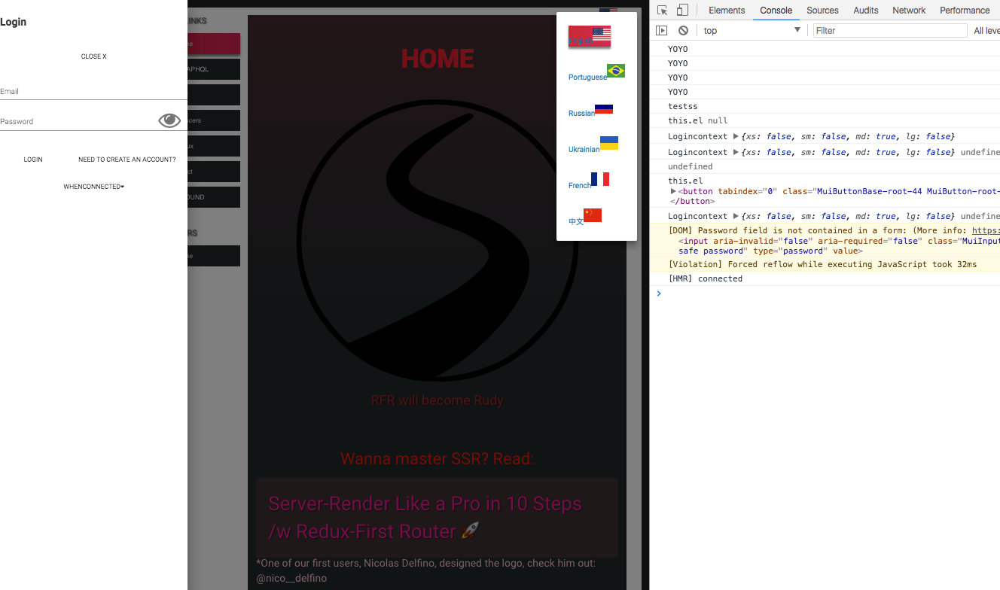

THIS IS AN OUTDATED PROJECT
if you need an universal Application around gatsby apollo using graphql (prisma) then just follow the link:
Please right now refer to 
https://github.com/simonjoom/Gatsby-apollo-chatkiller

I think now gatsby remain the best to make a ssr react application to have nice SEO


Apollo-RFX-PRISMA
===

1. [Apollo-RFX-PRISMA](#apollo-rfx-prisma)
  1. [README](#readme)
  2. [Inside](#inside)
  3. [Installation](#installation)
  4. [SVG](#svg)
    1. [This boilerplate have got a fully support for SVG so you need to install it](#this-boilerplate-have-got-a-fully-support-for-svg-so-you-need-to-install-it)
  5. [ROADMAP](#roadmap)
  6. [How-to integrate Apollo 2.0 in the Redux-FLow for a Universal Application](#how-to-integrate-apollo-20-in-the-redux-flow-for-a-universal-application)
    1. [Apollo 2 has got his own 'mapStateToProps'](#apollo-2-has-got-his-own-mapstatetoprops)
  7. [We use for faster build:](#we-use-for-faster-build)
  8. [Files You Should Look At:](#files-you-should-look-at)

## README
Before to start this project is not stable, the reaction link of rfx are buggy for now. we are waiting, the final version coming soon.

We propose just to share one implementation , because this HOW-TO can help people to work with **Apollo2** and the redux state together.

## Inside
- ***Apollo 2.0*** with ***Prisma*** already setup (no need to make a prisma deploy or a prisma init the server take care)
- Socket apollo work and setting up
- Apollo Playground in [http://localhost:4000/playground/](http://localhost:4000/playground/)
- Redux integrated with Redux-first-router
- Code splitting with react-universal-component
- Webpack 4 using with ~~**babel-watch**~~ **ts-node** for watching ts files using nodemon
- sass-loader/css-loader in hot reload
- Babel 7.0 (latest)
- react-intl working (flags and language management)
- ~~'apollo-cache-redux' to use redux and apollo 2.0~~
- Apollo cache and apollo-link-state for the store
- We kept redux flow for RFX
- svg transform with **svgr**

For now redux is only here to dispatch action around middleware and his resolvers, the store is managed by apollo-state

Subscribtion are managed by apollo

initial branch rfx we work on it:
https://github.com/faceyspacey/redux-first-router/tree/rudy-respond/src

 
 A lot more features and use-cases are covered there, but this *boilerplate* is the best place to start to learn the basics of RFR,
  especially if you're new to any of these things: SSR, Code Splitting, Express, APIs, Webpack-4 and Redux in general.

You can test redux-first-router on sandbox:
<a href="https://codesandbox.io/s/github/faceyspacey/redux-first-router-codesandbox" target="_blank">
  
</a>


## Installation

```
git clone https://github.com/simonjoom/Apollo-RFX-PRISMA-ssr-boilerplate
cd Apollo-RFX-PRISMA-ssr-boilerplate


npm install -g prisma
npm install -g graphql-cli
npm install
npm install iconv (i got some strange error else)
cp -Rf ./myth ./node_modules/colors.css/ (to support last version for bass)

npm run start
```

nota if compilation stop:
"Error: ENOENT: no such file or directory, open '/Users/simon/boilerplate/node_modules/.cache/autodll-webpack-plugin/development_instance_0_eb5b692a121be415174ccfc3c96419e9/stats.json'"
remove the folder /Users/simon/boilerplate/node_modules/.cache

Warning this boilerplate is depending svg working please see: [SVG](#svg) 
 
vs-code

For help, see: https://nodejs.org/en/docs/inspector

+ The application run by default here:
  + [http://localhost:3000/](http://localhost:3000/)
+ The playground run by default here:
  + [http://localhost:4000/playground/](http://localhost:4000/playground/)


## SVG
### This boilerplate have got a fully support for SVG so you need to install it

TO install the support of SVG in your computer (mac):
We use this feature: https://github.com/facebook/create-react-app/pull/3718
```
import logo from './logo.svg'; // gives you the filename
import { ReactComponent as Logo } from './logo.svg'; // gives you a React component <Logo />
```

update your node install maybe before to start with that.

UPDATE :
Uses the latest version of sass-loader.

```
brew install node
npm install svgr --save
npm install canvas --save
--> you have got an error you need to install something more for node:
--> for mac:
brew install pkgconfig
brew install cairo
npm install canvas --save

you need to rebuild node-sass if you are updated node: (reinstall it if complaining)
npm rebuild node-sass --force
```
if you do not do it, you should to remove svg from this boilerplate

https://github.com/smooth-code/svgr


## ROADMAP
The repo is well tested in Developpment mode only first

We really need a good developper with PRISMA or graphql to work on:
- Test and optimization our redux-apollo implementation
- Login user for facebook and others
- Tchat implementation Backend
- Code optimization
- [***src/containers***](./src/containers) - ***(some containers to add into)***
 

Some useful links to learn Last APOLLO:
- https://github.com/apollographql/
- https://github.com/apollographql/apollo-client/blob/2.0/docs/source/basics/mutations.md


## How-to integrate Apollo 2.0 in the Redux-FLow for a Universal Application

This could call a How to integrate Apollo2 with redux working libraries
LIke a lot i didn't like to have 2 store one for redux and one for apollo
```
  <Provider store={store}>
    <ApolloProvider client={client}>
      <App/>
      </ApolloProvider>
      </Provider>
```
As well after thinking that a apollo-cache-redux is not the solution (we want apollo)

So after many investigation with redux original code.   
I decided to create a modified 'createStore' from original redux ->see [***configureStore.js***](./src/configureStore.js)  

Now the user have to pass by Apollo when he is developping.

That could help people want to transfert his redux application to an Apollo one. 

var ```client``` is the name of the var holding the Apollo-client

```client.dispatch``` is just the ```store.dispatch``` of redux. 

```client.getState``` is like ```store.getState```

```client.getInitialState()``` allow us to take the ```window.__APOLLO_STATE__``` and fetch to a REDUX_STATE (without typename inside) for the initialization of Redux


In the working process of createStore of [***src/configureStore.js***](./src/configureStore.js)  still we have got nothing in Apollo cache we let the first action of redux dispatching in his middleware and only after we switch the store to Apollo.

The subscriptions are only managed with apollo now so take care to remove 
all connection to redux (connect) and add a Apollo2 Version (with **Query** by example)

Yes i could keep it but i really think that it's better to work only with Apollo2 for this. (and to not mix everythings)

### Apollo 2 has got his own 'mapStateToProps'

We created a Apollo-store with his apollo-cache-inmemory from a redux store json  
We Use 2 utility function to add typename in the var store else apollo-cache-inmemory is complaining for his working process to not see them:

[***initApollo.js***](./initApollo.js) :
```Markdown 
+ FETCH_STORE: it s your query who contain the hierarchie state of your code (important)

+ client.getState/ client.saveStore just functions that can use a PURE Apollo component to save the store and get the Apollo store.

+ removeObjType//addObjType:
  + to delete the typename from the cache (better when you pass back the state to redux)
  + to add one typename for all keys of the state object to pass to the store of Apollo 2
```
To conclude:

At the end We have got something working great with only;

``` 
<ApolloProvider client={client}>
 <App/>
</ApolloProvider> 
```

If you use Query or Mutate from Apollo2 to create your wrapped component connected; Then :

You can get getState and the dispatch of redux from the context of client.
like so this.context.client.dispatch -> get the same data that before this.context.store.dispatch,

So if you dispatch an action for a full redux working component he will receive and play his state like before but only if you did put the connect for Apollo 2 and made properly the changes. 


## We use for faster build:
AutoDllPlugin /cache-loader /thread-loader
Please be sure to remove .cache-loader sometimes to check the working process

Font-awesome.scss is builded at first build (take long ) but after very fast developpement because cache-loader. 


## Files You Should Look At:

*client code:*
- [***lib***](./lib/index.js) - ***(the source code of RFR)***
- [***webpack***](./webpack/server.dev.js) - ***(the ssr webpack-4 configuration)***
- [***webpack***](./webpack/client.dev.js) - ***(the client webpack-4 configuration)***
- [***initApollo.js***](./initApollo.js) - ***(the client webpack-4 configuration)***
- [***src/configureStore.js***](./src/configureStore.js)
- [***src/routes.js***](./src/routesMap.js) - ***(the primary work of RFR)***
- [***src/page***](./src/page) - ***(All your pages are here / each one seperated and splitted by react-universal)***
- [***src/components/Switcher.js***](./src/components/Switcher.js) - *(universal component concept)*
- [***src/components/Sidebar.js***](./src/components/Sidebar.js) - *(look at the different ways to link + dispatch URL-aware actions)*

*server code:*
- [***server/index.js***](./server/index.js)
- [***server/render.js***](./server/render.js) - *(super simple thanks to [webpack-flush-chunks](https://github.com/faceyspacey/webpack-flush-chunks) from our ***"Universal"*** product line)*
- [***server/configureStore.js***](./server/configureStore.js) - ***(observe how the matched route's thunk is awaited on)***


